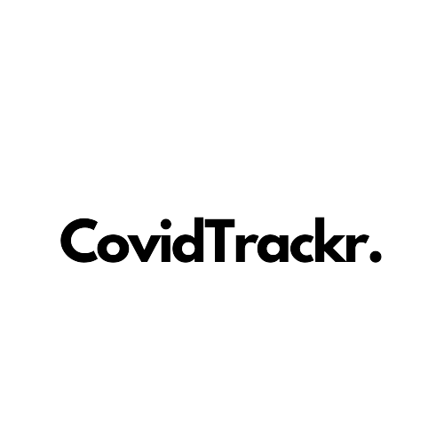

<a name="readme-top"></a>

<div align="center">
  
</div>

<!-- TABLE OF CONTENTS -->

# 📗 Table of Contents

- [📖 About the Project](#about-project)
  - [🛠 Built With](#built-with)
    - [Tech Stack](#tech-stack)
    - [Key Features](#key-features)
- [💻 Getting Started](#getting-started)
  - [Prerequisites](#prerequisites)
  - [Setup](#setup)
  - [Install](#install)
  - [Usage](#usage)
  - [Run tests](#run-tests)
  - [Deployment](#deployment)
- [👥 Authors](#authors)
- [🔭 Future Features](#future-features)
- [🤝 Contributing](#contributing)
- [⭐️ Show your support](#support)
- [🙏 Acknowledgements](#acknowledgements)
- [📝 License](#license)

<!-- PROJECT DESCRIPTION -->

# 📖 [CovidTrackr] <a name="about-project"></a>

**[CovidTrackr]** is a dynamic web-based COVID-19 tracking app powered by data from covid-api.com API. I helps users stay informed with real-time updates on cases by country, sort and filter information effortlessly. Your go-to tool for monitoring the global COVID-19 situation.

## 🛠 Built With <a name="built-with"></a>

### Tech Stack <a name="tech-stack"></a>

<details>
  <summary>Client</summary>
  <ul>
    <li><a href="https://developer.mozilla.org/en-US/docs/Web/HTML">HTML</a></li>
    <li><a href="https://developer.mozilla.org/en-US/docs/Web/CSS">CSS</a></li>
    <li><a href="https://reactjs.org/">React.js</a></li>
  </ul>
</details>

<!-- Features -->

### Key Features <a name="key-features"></a>

- **[Rockets_page]**
- **[Missions_page]**


<p align="right">(<a href="#readme-top">back to top</a>)</p>

<!-- GETTING STARTED -->

## 💻 Getting Started <a name="getting-started"></a>

To get a local copy up and running, follow these steps.

### Prerequisites

In order to run this project you need:

- Version control (Git preferred)
- Node.js
- Code editor (VS Code preferred)

### Setup

Clone this repository to your desired folder:

Example commands:

```sh
  cd my-folder
  git clone git@github.com:DevaWinner/space-travelers-hub.git
```

### Install

Install this project with:

Example command:

```sh
  cd my-project
  npm install
```

### Usage

To run the project, execute the following command:

### `npm start`

Runs the app in the development mode.\
Open [http://localhost:3000](http://localhost:3000) to view it in your browser.

The page will reload when you make changes.\
You may also see any lint errors in the console.

### Run tests

To run tests, run the following command:

### `npm test`

Launches the test runner in the interactive watch mode.\
See the section about [running tests](https://facebook.github.io/create-react-app/docs/running-tests) for more information.

### Deployment

You can deploy this project using:

### `npm run build`

Builds the app for production to the `build` folder.\
It correctly bundles React in production mode and optimizes the build for the best performance.

The build is minified and the filenames include the hashes.\
Your app is ready to be deployed!

<p align="right">(<a href="#readme-top">back to top</a>)</p>

<!-- AUTHORS -->

## 👥 Authors <a name="authors"></a>

👤 **Aniekan Winner**

- GitHub: [@githubhandle](https://github.com/DevaWinner)
- Twitter: [@twitterhandle](https://twitter.com/WinnerDevq)
- LinkedIn: [LinkedIn](https://www.linkedin.com/in/winnera/)


<p align="right">(<a href="#readme-top">back to top</a>)</p>

## 🤝 Contributing <a name="contributing"></a>

Contributions, issues, and feature requests are welcome!

Feel free to check the [issues page](https://github.com/DevaWinner/space-travelers-hub/issues).

<p align="right">(<a href="#readme-top">back to top</a>)</p>

<!-- SUPPORT -->

## ⭐️ Show your support <a name="support"></a>

I appreciate any contributions to enhance the web app. To contribute, please follow these steps:

- Fork the repository.
- Create a new branch for your feature or bug fix: git checkout -b feature/your-feature-name or bugfix/your-bug-fix-name
- Commit your changes: git commit -m 'Add some feature'
- Push to the branch: git push origin feature/your-feature-name
- Open a pull request to the main branch of this repository.
- I review and merge contributions regularly. Thank you for your support!


<p align="right">(<a href="#readme-top">back to top</a>)</p>

<!-- ACKNOWLEDGEMENTS -->

## 🙏 Acknowledgments <a name="acknowledgements"></a>

I would like to express my gratitude to the following individuals and organizations for their valuable contributions and support:

[Nelson Sakwa:](https://www.behance.net/sakwadesignstudio) For his exceptional design whose template is used for this project.

[Lilly Rum:](https://unsplash.com/@rumandraisin) For her images that is being used in the hero background.

[Freepik.com](https://www.freepik.com) This website has been designed using image assets from Freepik.com.


If I have unintentionally missed anyone who deserves acknowledgment, please let me know, and I will gladly include them.

Thank you all for your contributions and for being part of my project!


<p align="right">(<a href="#readme-top">back to top</a>)</p>

<!-- LICENSE -->

## 📝 License <a name="license"></a>

This project is [MIT](./LICENSE) licensed.

<p align="right">(<a href="#readme-top">back to top</a>)</p>